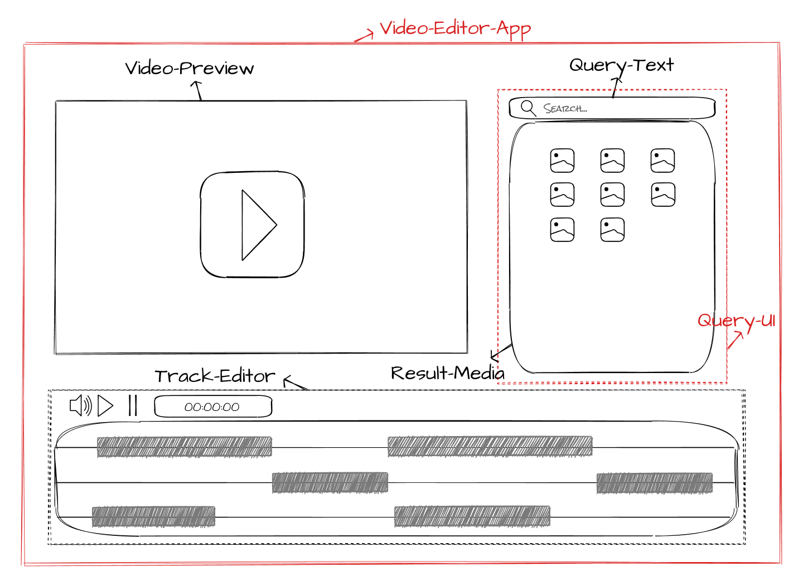

# Project overview

This repository contains a set of reusable Web Components and an app that uses them. The app is a multimedia editing tool (video-editor).

The app entry-point is the Video-Editor-App wrapper which contains the following component structure:

-   Video-Editor-App [https://github.com/lukasd2/phrmx-components/tree/main/components/video-editor-app]
    -   Video-Preview [https://github.com/lukasd2/phrmx-components/tree/main/components/video-preview]
    -   Track-Editor [https://github.com/lukasd2/phrmx-components/tree/main/components]
-   Query-Ui [https://github.com/lukasd2/phrmx-components/tree/main/components/query-ui]
    -   Query-Text [https://github.com/lukasd2/phrmx-components/tree/main/components/query-text]
    -   Result-Media [https://github.com/lukasd2/phrmx-components/tree/main/components/result-media]



A detailed description of the app can be found in "Remix Culture: development of a component based
multimedia editing platform", pages 66-80 [https://github.com/lukasd2/Remix-Culture-development-of-a-component-based-multimedia-editing-platform/blob/e73bae3ce8fa9eddfd83e12dfbab7de2718733f7/Dissertation_RemixCulture.pdf].

## Quickstart

Follow the installation instructions for installing the entire Video-Editor-App. Otherwise refer to the docs inside each component repository.

To get started:

Fast-start, ideal for local development

_Remember to create config.js files!_

```bash
npm i
lerna bootstrap
cd components/video-editor-app
npm start
```

Alternatively, generate a /dist bundle with Rollup module bundler and switch the imports inside demo/_index.html_ from CDNs to local bundle path.

```bash
npm i
lerna bootstrap
npm build
cd components/video-editor-app
npm start
```

Also instead of npm build, the npm dev is indicated for the live reload development (watch mode).

Important for the bundle, include Shoelace dependency into each component (for example QueryText.js, ResultMedia.js etc.). If the /dist folder does not contain the _base.css_ file and and shoelace assets directory try importing it manually inside each component.

```javascript
import "@shoelace-style/shoelace/dist/themes/base.css";
import "@shoelace-style/shoelace";
```

Also refer to the Sholace library guides: [https://shoelace.style/getting-started/installation].

## Config.js

A config.js has to placed in the main directory for the Video-Edtior-App (app) and Query-Ui (component) as it is needed in most cases. It contains the API-keys and has to be created manually.
An example of a config file can be found below:

```javascript
// config.js
const config = {
    API_KEY: "<insert_your_key_here>",
    PEXELS_API_KEY: "<insert_your_key_here>",
};

export { config };
```

## License

Each component inside this repository is licensed under the [MIT](https://choosealicense.com/licenses/mit/) license.
